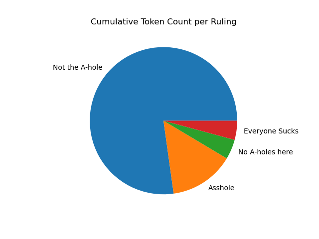
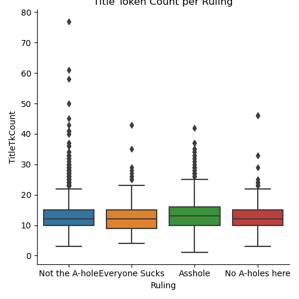
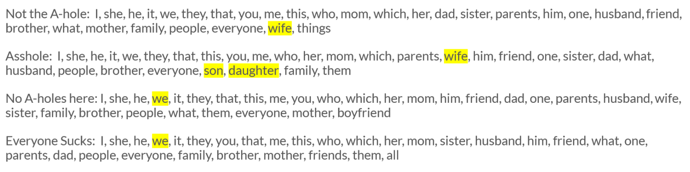

# AITA Blame Shifting
by Alexander Ocampo

## Background
### About the Community
[r/AmITheAsshole](https://www.reddit.com/r/AmItheAsshole/) describes itself as "a place to finally find out if you were wrong in an argument that's been bothering you." In this community, users submit posts explaining a conflict they have engaged in and commenters vote on whether the user was justified in their behavior. As of the end of 2022, r/AmITheAsshole is the most viewed subreddit on the entire website ("Revealing This").
In this subreddit, commenters vote on one of five rulings to judge the behavior of the original poster. In any given situation, the poster may be declared the Asshole, the poster may be declared Not the Asshole, the readers may declare the story to have No Assholes here, the readers may declare that Everyone Sucks Here, and the readers may declare there is Not Enough Info. 
### Project Goals
This project considers how these users frame the people and events in their stories in order to highlight or downplay the agency of the different parties. In some cases, these tactics may be used to try and ameliorate the actions of the writer. In other cases, these tactics may be used to emphasize the circumstances of the events to try and see the another person's side of the story. Regardless, I intend to break down the language being used on this subreddit in order to question how people draw emphasis to facets of their stories and why.

## Data Collection
For this project, I gathered my own data set through posts submitted to r/AmItheAsshole. The final data set can be found [here](data\aita_data.csv). To collect my data I utilized the two Python libraries, [PRAW](https://praw.readthedocs.io/en/latest/index.html) and [PMAW](https://github.com/mattpodolak/pmaw). PRAW allows me to use my Reddit account credentials to connect to the Reddit API. However, the Reddit API has strict regulations where you cannot gather more than one thousand posts from any given subreddit. So, I used PRAW to connect my Reddit account to a third-party API named Pushshift which allowed me to scrape significantly larger amounts of data from the subreddit. Pushshift is then integrated into Python using the PMAW wrapper.
### Setbacks
While experimenting with the data collection process in [data_collection_test.ipynb](https://nbviewer.org/github/Data-Science-for-Linguists-2023/AITA-Blame-Analysis/blob/main/code/data_collection_testing.ipynb), I discovered a few issues. Firstly, the "limit" parameter is currently bugged so that any attempt to collect more than 1000 posts will collect all posts available for your search. Next, the Pushshift API is currently undergoing a migration that limits the available posts to only those submitted after November 2022. Furthermore, there are many posts saved to the archive that simply state "\[deleted]" or "\[removed]" as their text. Lastly, as seen in [the sample data I collected for this trial run](data\aita_data_sample.csv), many posts are archived in the Pushshift API prior to their final ruling being tagged using a "link flair." As this project centers around how language relates to rulings, posts without those tags are useless to me.
### Solutions and Organization
To solve these problems, I collected one thousand posts every day within a four-month period, resulting in a starting corpus of almost 120,000 posts. The collection process can be found [here](https://nbviewer.org/github/Data-Science-for-Linguists-2023/AITA-Blame-Analysis/blob/main/code/data_collection_testing.ipynb#Scraping-from-Pushshift-API) From there, I removed all posts that did not have relevant link flairs, all posts that did not have real text for their bodies, and all repeat posts. The cleaning process can be found [here](https://nbviewer.org/github/Data-Science-for-Linguists-2023/AITA-Blame-Analysis/blob/main/code/data_collection_testing.ipynb#Narrowing-Down-Data-Set). Lastly, because this subreddit is controversial in nature and many people even create new accounts solely to post their story onto this subreddit, I decided to remove all usernames and replace them with a number ID. In the end, the data set maintains 9.415 posts. It can be found [here](data\aita_data.csv).
Below is a breakdown of the corpus by number of posts and by number of tokens per ruling. Although there are five rulings on this subreddit, I omitted Not Enough Info from my data set as it is not productive to my goals. These pie charts look nearly identical, and overall it is important to note that the data set has a significant overrepresentation of post marked Not the Asshole. I suppose it just happens that most people who post to this subreddit are vindicated in their choices.

## Analysis
### Quantitative Analysis: Token Count
The first metric I looked at was the average token count across posts for a ruling. r/AmITheAsshole has a strict character limit of 3000 characters, however, not all stories need to use the entire space to be told. I hypothesized that Assholes will on average have a higher token count than the other rulings as guilty people may work harder to overcompensate for their actions. The work to uncover these token counts can be found [here](https://nbviewer.org/github/Data-Science-for-Linguists-2023/AITA-Blame-Analysis/blob/main/code/data_analysis.ipynb#Finding-Token-Count-of-Each-Post)
1[png](figures/post_token_count.png)
The plot shows that posts marked Not the Asshole actually skew slightly longer on average than Not the Asshole posts. This may imply that, instead of being perceived as overcompensating, writing more simply provides a higher amount of context that allows readers to actually understand their position. The low token count on No Assholes Here might show that there is not enough of a story being told to worry about it. Lastly, posts marked as Everyone Sucks have the overall highest average token count, which may suggest that there is so much going on in a story by all parties that everyone should be to blame for the outcome.
I also tried to see if there was anything to note about the average lengths of post titles. However, there is a website-wide limit of 300 characters for a title. The plot shows that there is very minimal difference between the averages while there's also a significant amount of data marked as outliers, so this does not seem like a meaningful metric to analyze.

### Quantitative Analysis: Measuring Subjects
The bulk of my project analyzes the subjects of sentences to detect any trends in the kinds of stories told as well as how the people in those stories are treated. To do this, I utilized the [spaCy](https://spacy.io/) library to break each post into its dependencies and then extract all subjects. While a numeric breakdown of the top 30 subjects for each ruling can be found [in my notebook](https://nbviewer.org/github/Data-Science-for-Linguists-2023/AITA-Blame-Analysis/blob/main/code/data_analysis.ipynb#Finding-Top-Subjects-per-Ruling), below I have included the top subjects without the numbers for ease of reading.

While most of the subjects across the rulings are pronouns and familial terms in roughly the same order, a few differences stick out. First, "wife" appears significantly higher in the hierarchy for the Asshole category than the Not the Asshole category. This could imply a few things. Perhaps people who cause more trouble are more likely to have negative relationships. Maybe those stories reflect misogyny. Maybe the readers have biases to side with women. Next, while there are several terms that refer to parents across these lists, terms for _children_ only appear for Assholes. Again, this could either indicate that people who are Assholes complain about their children more, or, that readers are more likely to immediately side with who they see as the disempowered party in a story. Lastly, "we" appears slightly higher for No Assholes Here and Everyone Sucks versus Not the Asshole and Asshole. This suggests that, in those stories, the events that occurred are more overtly a group-effort that would lump all parties together, whether as the victims or perpetrators of the overall event.
### Quantitative Analysis: Considering Passive and Active Voice
Using spaCy, I separated the nominal subjects into passive subjects and active subjects. The goal here is to question who and what writers ascribe agency to. My initial theory is that people marked as Assholes will use more passive voice on average as they attempt to cover themselves up as the causes of problems within their stories.

The plot shows that posts marked Not the A-hole use a larger amount of passive clauses relative to the total number of clauses in the post. However, I am weary to draw conclusions from this metric. It may be a coincidence, but the order of most to least passive rulings is the same order as the most to least number of posts in the data set. It's possible that this plot would look more even if the data set was more even, but for now, that is uncertain.
A much more extensive breakdown of what the actual passive versus active subjects are for [Not the Asshole posts](https://nbviewer.org/github/Data-Science-for-Linguists-2023/AITA-Blame-Analysis/blob/main/code/data_analysis.ipynb#Breakdown-of-NTA-Subjects) and [Not the Asshole](https://nbviewer.org/github/Data-Science-for-Linguists-2023/AITA-Blame-Analysis/blob/main/code/data_analysis.ipynb#Breakdown-of-YTA-Subjects) posts can be found within the notebook. This includes some considerations of grammatical feasibility and animacy. But, for this summary, I will draw attention to one facet of this analysis:

Above is a breakdown of the top passive and top active subjects for Not the Asshole and Asshole posts that explicitly denote gender. For the lists of Not the Asshole subjects, the order of the genders represented in either list maintains roughly the same. But, in the Asshole lists, there is a clear separation. Masculine terms are represented higher up in the passive list whereas masculine terms are represented lower down in the active list. Conversely, feminine terms are shown to be more active than passive. This might allude to the theory I proposed earlier. The writers might be more willing to downplay the agency of men in their stories in order to shift the blame onto other parties. Yet, they do not afford the same grace to the women in their stories, implying that they should be held accountable for their actions.
### Qualitative Analysis: Key Examples of Subject Use
Lastly, throughout my analysis I employ several textual examples to reflect on these ideas on voice and agency. To read through them all, I suggest looking through the [table of contents in my data analysis notebook](https://nbviewer.org/github/Data-Science-for-Linguists-2023/AITA-Blame-Analysis/blob/main/code/data_analysis.ipynb). For now, I would like to compare and contrast some quotes from two posts.
The first post is one titled ["AITA for telling my mom I don't care about my little brothers"](https://nbviewer.org/github/Data-Science-for-Linguists-2023/AITA-Blame-Analysis/blob/main/code/data_analysis.ipynb#Example,-Post-with-the-Overall-Most-Passive-Subjects). Here, a sixteen year old boy explains how frustrated he is with his two baby brothers who often destroy his things. This post uses the most passive voice of any post in the corpus. He states:
> immediately my switch was thrown of the floor, my desk was completely trashed, and my phone was being yanked out of my hands by my toddler brother, I was fed up and yelled at my mom to just leave because I don’t have any desire to spend time with them and to stop forcing me to love them.
While some may consider the things he said to his mother to be mean and disrespectful, I want to highlight how he uses passive voice. While he does not hide that he does not like his brothers and that they do cruel things to him, this phrasing emphasizes his own feelings about the situation. Passive voice is actually being used to soften any kinds of attacks on the egos of his brothers in order to platform this teenager's main problem: he feels out of control in his own home. As such, I believe readers could pick up on the feelings of this poster and understands that he wants his own space. This led to a final verdict of Not the Asshole.
I will compare this to another post titled ["AITA for calling the police on my kid?"](https://nbviewer.org/github/Data-Science-for-Linguists-2023/AITA-Blame-Analysis/blob/main/code/data_analysis.ipynb#Example,-"Kid"-as-Unempowered-in-Narrative). In this story, a parent talks about how their 16-year-old kid went to a hotel without their permission and the parent feared for their safety. In regards to passive voice, the parent writes:
> My kid was expected home at 7pm. (...) Due to recently, Thursday, choosing not to come home at night with no discussion (my kid is 16) my teen is required to have location turned on for their phone. Instead of coming home for dinner at 7 they went to a hotel in a bad part of town. When I asked why, they lied & said they were buying a charger.
In this scenario, passive voice is used to frame the actions of the kid through the expectations of the parent. So, passive voice is being used to diminish agency, not because the writer is trying to cover for actions of the kid, but because it is implied that they do not have a choice. While the teenager arguably does make dangerous decisions throughout this story, I believe that readers sensed from the writer that this is less of a problem about the actions of the child and moreso about the disrespect it implies. By using passive voice to emphasize their position above their child's agency, this poster was deemed an Asshole.
Clearly, passive voice can be used to fulfill a variety of functions. While it is used to diminish the agency of the actors, it is important to ask why someone intends to do that.

### Last Experiments: Machine Learning
Lastly, I wanted to touch on the final experiments I conducted using this data set. For the last portion of my analysis, I had hoped to use machine learning to try and classify posts by their ruling, and then once I developed a satisfactory model, consider what the defining features of each ruling were. However, after [several attempts at developing a model](https://nbviewer.org/github/Data-Science-for-Linguists-2023/AITA-Blame-Analysis/blob/main/code/data_analysis_experiments.ipynb), the best I could achieve was an accuracy of 57.8%.

Nonetheless, I decided to include this failed experiment in the final project as it still reflects some thoughtful problem-solving and critical thinking even if it could not lead to results. This includes the decision to convert the model to a binary classifier between Asshole/Not the Asshole posts instead of all four rulings as well as the decision to create an even subset of data to try and build the model from.

## Closing Thoughts on the Process
Overall, I faced numerous complications throughout this entire project. From the onset, with my issues with data collection, I had to keep working through and finding compromises to unexpected problems. I think the most difficult part of this project is that everything that I needed to experiment with took so much time: it would take upwards of half an hour to collect my data until I could figure out if it populated properly, it would take lengthy periods of time to figure out how to run spaCy and store it properly in a DataFrame, and working through so many slightly-different machine learning models became quite tedious. Nonetheless, I am proud of the solutions I arrived at (even if I wished there weren't any problems in the first place). One particular moment was when I was having difficulty trying to comb out full passive and active clauses instead of just the subjects. I wanted to use those as another quantifiable metric and see how long passive versus active clauses were. Instead, I decided to approach the concept by picking out key examples and doing analysis by simply reading them, and I think that enhanced the effect of the more quantifiable information I gathered by a lot.

## Conclusion
Overall, this project allowed me to explore several different, new processes for analyzing textual data. These results show that, although it may be hard to determine hard-lined patterns between Assholes and non-Assholes, there are particular behaviors we can use to emphasize key points in our stories. A very useful tool in developing a story's angle is the use of passive voice, which can shift the power dynamics and obfuscate the agency in a story. Further, there seem to be some trends in the contents of negative stories, such as the idea that people posting about their wives might just not like their wives. In the future, it would be interesting to get a machine learning model to work as a means to further consider the differences in writing style and content between rulings. But, ultimately, it seems as though the stories on r/AmITheAsshole are diverse in content and writing style, so it may be a good thing one machine cannot emulate the minds of hundreds and hundreds of strangers on the internet voting together.

# Works Cited
“Revealing This Year's Reddit Recap, Where We Highlight How Redditors Kept It Real in 2022.” _Upvoted_, Reddit Inc., 7 Dec. 2022, https://www.redditinc.com/blog/reddit-recap-2022-global.
